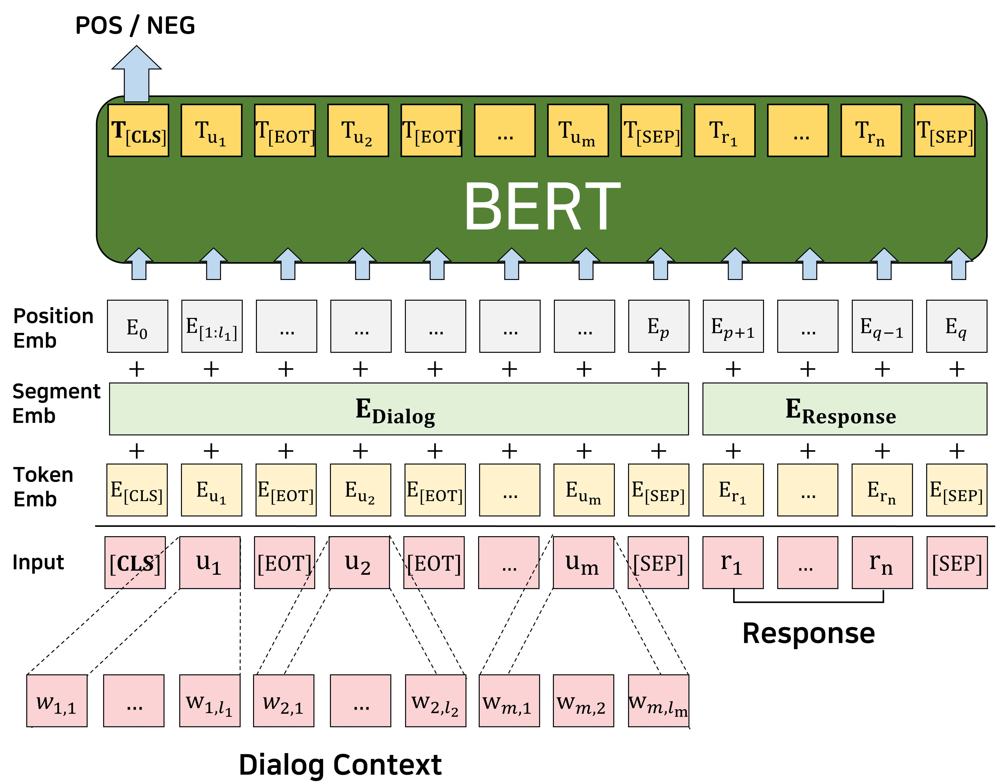

Domain Adaptive Training BERT for Response Selection
====================================
Implements the model described in the following paper [Domain Adaptive Training BERT for Response Selection](https://arxiv.org/abs/1908.04812).
```
@article{whang2019domain,
  title={Domain Adaptive Training BERT for Response Selection},
  author={Whang, Taesun and Lee, Dongyub and Lee, Chanhee and Yang, Kisu and Oh, Dongsuk and Lim, HeuiSeok},
  journal={arXiv preprint arXiv:1908.04812},
  year={2019}
}
```
This code is reimplemented as a fork of [huggingface/transformers][7].  

<center></center>


Data Creation
--------
1. Download `ubuntu_train.pkl, ubuntu_valid.pkl, ubuntu_test.pkl` [here][1] or you can create `pkl` files to train response selection model based on BERT model. 
If you wish to create pkl, download ubuntu_corpus_v1 dataset [here][2] provided by [Xu et al. (2016)](https://arxiv.org/pdf/1605.05110.pdf) and keep the files under `data/ubuntu_corpus_v1` directory.
2. Ubuntu corpus for domain post trianing will be created by running:
```shell
python data/data_utils.py
```

Post Training Data Creation
--------
Download `ubuntu_post_training.txt` corpus [here][3] and simply run
```shell
python data/create_bert_post_training_data.py
```
After creating post_training data, keep `ubuntu_post_training.hdf5` file under `data/ubuntu_corpus_v1`directory.

BERT Fine-tuning (Response Selection)
--------
### Training
Train a response selection model based on `BERT_base`:  
```shell
python main.py --model bert_base_ft --train_type fine_tuning --bert_pretrained bert-base-uncased
```

Train a response selection model based on `Domain post-trained BERT`. If you wish to get the domain post trained BERT, download model checkpoint (`bert-post-uncased-pytorch_model.pth`) [here][4],
 and keep checkpoint under `resources/bert-post-uncased` directory:  
```shell
python main.py --model bert_dpt_ft --train_type fine_tuning --bert_pretrained bert-post-uncased
```

### Evaluation
To evaluate `bert_base`,`bert_dpt` models, set a model checkpoint path and simply run  
```shell
python main.py --model bert_dpt_ft --train_type fine_tuning --bert_pretrained bert-post-uncased --evaluate /path/to/checkpoint.pth
```
If you wish to get the pre-trained response selection model, we provide the model checkpoints below. 

|   Model   |   R@1  |   R@2  |   R@5  |   MRR  |
|:---------:|:------:|:------:|:------:|:------:|
| [BERT_base][5] | 0.8115 | 0.9003 | 0.9768 | 0.8809 |
|  [BERT_DPT][6] | 0.8515 | 0.9272 | 0.9851 | 0.9081 |


Domain Post Training BERT
--------
To domain post-train BERT, simply run
```shell
python main.py --model bert_ubuntu_pt --train_type post_training --bert_pretrained bert-base-uncased
```

Acknowledgements
--------
- This work was supported by Institute for Information & communications Technology Promotion (IITP) grant funded by the Korea government (MSIT) (no. 2016-0-00010-003, Digital Centent InHouse R&D)
- Work in collaboration with [Kakao Corp][8].

[1]: https://drive.google.com/drive/folders/1mLzXifYYwmlFEWDzSbbecLlzKstB8gQK?usp=sharing
[2]: https://www.dropbox.com/s/2fdn26rj6h9bpvl/ubuntu_data.zip
[3]: https://drive.google.com/file/d/1mYS_PrnrKx4zDWOPTFhx_SeEwdumYXCK/view?usp=sharing
[4]: https://drive.google.com/file/d/1jt0RhVT9y2d4AITn84kSOk06hjIv1y49/view?usp=sharing
[5]: https://drive.google.com/file/d/1amuPQ_CtfvNuQMdRR8eo0YGAQLP4XBP7/view?usp=sharing
[6]: https://drive.google.com/file/d/1Ip_VqzpByWZRAgiN7OxPeyYxK6onPia0/view?usp=sharing
[7]: https://github.com/huggingface/transformers
[8]: https://www.kakaocorp.com
